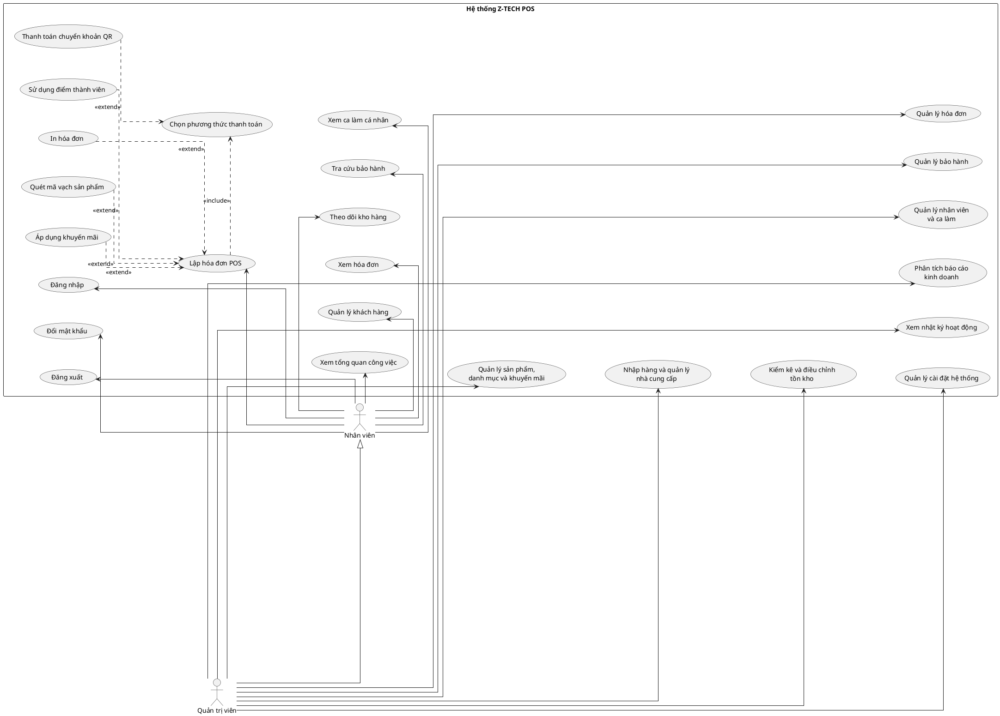

# Phân tích Use Case tổng quát hệ thống Z-TECH POS

## 1. Phạm vi và nguyên tắc

Tài liệu này mô tả Use Case tổng quát dựa trên source hiện tại của Z-TECH POS. Ảnh mẫu chỉ được dùng để tham khảo cách tổ chức actor và system boundary; tên chức năng, quyền và quan hệ trong sơ đồ đều được đối chiếu từ frontend, backend và database của dự án.

Sơ đồ giữ ở mức nghiệp vụ tổng quát. Riêng **Lập hóa đơn POS** được phân rã thành các hành vi trực tiếp xuất hiện trong quy trình bán hàng. Các thao tác CRUD chi tiết không được tách thành nhiều use case để tránh trộn cấp độ.

Không đưa **Khách hàng** vào sơ đồ tổng quát này. Hệ thống cũng không tích hợp PayOS hay một cổng thanh toán từ xa: mã VietQR được tạo cục bộ bằng `vietnam-qr-pay` và `qrcode`, vì vậy không có actor “PayOS Gateway”.

## 2. Actor và quyền

### Nhân viên

Đại diện cho các vai trò vận hành không có toàn quyền, gồm `employee`, `cashier` và các vai trò nhân viên tương đương.

Nhân viên có căn cứ thực hiện các nhóm chức năng:

- Đăng nhập, đăng xuất và đổi mật khẩu.
- Xem dashboard cá nhân/ca làm.
- Lập hóa đơn POS khi có ca làm đang hoạt động.
- Tra cứu hoặc quét sản phẩm; chọn khách hàng; áp dụng khuyến mãi và điểm thành viên; chọn phương thức thanh toán; in hóa đơn.
- Xem sản phẩm và tồn kho.
- Xem, tạo và cập nhật khách hàng; không có quyền xóa khách hàng.
- Xem hóa đơn thuộc phạm vi được backend trả về.
- Xem ca làm của mình.
- Tra cứu bảo hành và xem yêu cầu bảo hành.

### Quản trị viên

Đại diện cho role chuẩn `admin`; các role cũ `owner` và `manager` được backend chuẩn hóa thành `admin`.

Quản trị viên kế thừa các tương tác chung của Nhân viên và có thêm quyền:

- Xem dashboard quản trị và báo cáo kinh doanh.
- Quản lý sản phẩm, danh mục và khuyến mãi.
- Quản lý nhập hàng, công nợ nhập và nhà cung cấp.
- Kiểm kê/nhập thêm và điều chỉnh tồn kho.
- Cập nhật, hủy hoặc xóa hóa đơn theo API quản trị.
- Quản lý nhân viên, mật khẩu, trạng thái tài khoản và lịch/ca làm.
- Tiếp nhận và cập nhật yêu cầu bảo hành.
- Xem nhật ký hoạt động.
- Quản lý cài đặt hệ thống, VAT, in hóa đơn và chuyển khoản ngân hàng.

## 3. Danh sách Use Case tổng quát

| Mã | Use Case | Actor trực tiếp | Căn cứ chính |
|---|---|---|---|
| UC01 | Đăng nhập | Nhân viên | `POST /api/auth/login` |
| UC02 | Đăng xuất | Nhân viên | Xóa token/user khỏi localStorage hoặc sessionStorage |
| UC03 | Đổi mật khẩu | Nhân viên | `PUT /api/auth/change-password` |
| UC04 | Xem tổng quan công việc | Nhân viên | `/dashboard`, `StaffDashboard` |
| UC05 | Lập hóa đơn POS | Nhân viên | `/pos`, `POST /api/orders` |
| UC06 | Quản lý khách hàng | Nhân viên | API đọc/tạo/cập nhật khách hàng |
| UC07 | Xem hóa đơn | Nhân viên | `GET /api/orders`, `GET /api/orders/:id` |
| UC08 | Theo dõi kho hàng | Nhân viên | `/inventory`, API đọc sản phẩm và nhật ký kho |
| UC09 | Tra cứu bảo hành | Nhân viên | `GET /api/warranties` và API xem claim |
| UC10 | Xem ca làm cá nhân | Nhân viên | `/shifts`, `GET /api/shifts` |
| UC11 | Quản lý sản phẩm, danh mục và khuyến mãi | Quản trị viên | API ghi products/categories/promotions yêu cầu `requireFullAccess` |
| UC12 | Nhập hàng và quản lý nhà cung cấp | Quản trị viên | API purchase-orders/suppliers yêu cầu `requireFullAccess` khi ghi |
| UC13 | Kiểm kê và điều chỉnh tồn kho | Quản trị viên | `POST /api/inventory/add`, `PUT /api/inventory/adjust` |
| UC14 | Quản lý hóa đơn | Quản trị viên | Cập nhật/xóa đơn yêu cầu `requireFullAccess` |
| UC15 | Quản lý bảo hành | Quản trị viên | Tạo/cập nhật warranty claim yêu cầu `requireFullAccess` |
| UC16 | Quản lý nhân viên và ca làm | Quản trị viên | API employees và ghi shifts yêu cầu `requireFullAccess` |
| UC17 | Phân tích báo cáo kinh doanh | Quản trị viên | API dashboard/reports yêu cầu `requireFullAccess` |
| UC18 | Xem nhật ký hoạt động | Quản trị viên | `GET /api/activity-logs` yêu cầu `requireFullAccess` |
| UC19 | Quản lý cài đặt hệ thống | Quản trị viên | API ghi settings/VAT/bank-transfer yêu cầu `requireFullAccess` |

## 4. Quan hệ trong nghiệp vụ lập hóa đơn

- **Chọn phương thức thanh toán** là `<<include>>` của **Lập hóa đơn POS**, vì payload tạo đơn luôn có phương thức thanh toán.
- **Quét mã vạch sản phẩm** là `<<extend>>`, vì nhân viên cũng có thể tìm và chọn sản phẩm thủ công.
- **Áp dụng khuyến mãi** là `<<extend>>`, vì đơn hàng có thể không có khuyến mãi.
- **Sử dụng điểm thành viên** là `<<extend>>`, vì chỉ có khi chọn khách hàng thành viên và nhân viên quyết định dùng điểm.
- **Thanh toán chuyển khoản QR** là `<<extend>>` của **Chọn phương thức thanh toán**, vì đây chỉ là một lựa chọn bên cạnh tiền mặt.
- **In hóa đơn** là `<<extend>>` của **Lập hóa đơn POS**, vì hệ thống cho phép in sau thanh toán hoặc tự động in nếu cài đặt bật.

## 5. Mã PlantUML

## 6. Bằng chứng từ source

### Actor, đăng nhập và phân quyền

- `frontend/src/utils/permissions.js`: quyền theo đường dẫn của nhân viên và nhóm full-access.
- `frontend/src/utils/auth.js`: nhận diện role full-access và đăng xuất.
- `backend/utils/roles.js`: chuẩn hóa `owner`, `manager`, `admin` thành `admin`.
- `backend/middleware/auth.js`: xác thực JWT và middleware `requireFullAccess`.
- `backend/middleware/activeShift.js`: nhân viên phải có ca đang hoạt động khi bán hàng; quản trị viên được miễn điều kiện này.
- `backend/controllers/authController.js`: đăng nhập, lấy tài khoản hiện tại và đổi mật khẩu.

### Bán hàng, khách hàng, hóa đơn và bảo hành

- `frontend/src/pages/POS.jsx`: quét mã vạch, giỏ hàng, chọn khách hàng, khuyến mãi, điểm, tiền mặt/chuyển khoản, tạo đơn và in hóa đơn.
- `frontend/src/utils/bankTransfer.js`: tạo payload và ảnh VietQR cục bộ.
- `backend/routes/orders.js` và `backend/controllers/orderCreateController.js`: tạo, xem và quản lý đơn hàng.
- `backend/routes/customers.js`: đọc/tạo/cập nhật khách hàng cho người đã đăng nhập; xóa yêu cầu full-access.
- `backend/routes/warranties.js`: xem bảo hành; tạo và cập nhật claim yêu cầu full-access.

### Kho hàng và quản trị

- `frontend/src/App.jsx` và `frontend/src/components/Sidebar.jsx`: các màn hình nghiệp vụ thực tế.
- `backend/routes/products.js`, `categories.js`, `promotions.js`: đọc dữ liệu cho nhân viên, ghi dữ liệu cho quản trị viên.
- `backend/routes/inventory.js`: xem lịch sử kho; nhập thêm và điều chỉnh tồn yêu cầu full-access.
- `backend/routes/purchaseOrders.js` và `suppliers.js`: nhập hàng, thanh toán công nợ nhập và quản lý nhà cung cấp.
- `backend/routes/employees.js` và `shifts.js`: quản lý nhân viên và ca làm.
- `backend/routes/dashboard.js`, `reports.js`, `activityLogs.js`, `settings.js`: báo cáo, nhật ký và cài đặt dành cho quản trị viên.
- `database/schema.sql`: các bảng `users`, `products`, `customers`, `orders`, `order_items`, `inventory_logs`, `promotions`, `purchase_orders`, `payments`, `warranties` và `warranty_claims`.

## 7. Giả định và giới hạn

- “Quản trị viên” là actor tổng quát cho role chuẩn `admin` và hai role cũ được chuẩn hóa là `owner`, `manager`.
- “Nhân viên” gom các role vận hành vì frontend đang cấp cùng tập quyền đường dẫn cho mọi role không thuộc nhóm full-access.
- **Quản lý khách hàng** ở phía Nhân viên chỉ bao gồm xem, tạo và cập nhật; thao tác xóa thuộc quyền Quản trị viên nhưng không tách thành use case chi tiết trong sơ đồ tổng quát.
- **Quản lý bảo hành** của Quản trị viên chỉ phản ánh các API claim đã triển khai. Hàm điều chỉnh tồn khi đổi sản phẩm trong `Warranty.jsx` hiện chưa có xử lý backend nên không được thể hiện thành chức năng độc lập.
- Route tra cứu bảo hành công khai có tồn tại, nhưng actor Khách hàng được chủ động loại khỏi sơ đồ này theo phạm vi đã yêu cầu.
